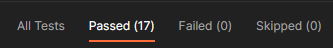

<h2>Desafio - Testes de API automatizado - Getnet</h2>

API utilizada: https://reqres.in/api

## Frameworks Utilizados

### 🌐 RestAssured

Tecnologias utilizadas:

- [REST Assured](https://rest-assured.io)
- [JUnit](https://junit.org/junit4)
- [Maven](https://maven.apache.org)
- [Postman](https://www.postman.com)

Estrutura das pastas:

📂 services/</br>
&nbsp; &nbsp; &nbsp;🍵Base.java (Onde está classe base)<br>
📂 services/</br>
&nbsp; &nbsp; &nbsp;🍵Service.java (Onde está classe de services)<br>
📂 suitesTets/<br>
&nbsp; &nbsp; &nbsp;🍵TestDelete.java (Onde está classe para excluir cadastro)<br>
&nbsp; &nbsp; &nbsp;🍵TestGetUser.java (Onde está classe de consultas)<br>
&nbsp; &nbsp; &nbsp;🍵TestPatchUser.java (Onde está classe de atualizar cadastros)<br>
&nbsp; &nbsp; &nbsp;🍵TestPostUser.java (Onde está classe de cadastros)<br>
&nbsp; &nbsp; &nbsp;🍵TestPutUser.java (Onde está classe de atualizar cadastros)<br>
🪶pom.xml (Arquivo do maven com as configurações e repositórios)

## ⚙️ Rodando o Projeto

```bash
# Clone este repositório
$ git clone https://github.com/diogomfc/challenge_getnet_api
# ou use a opção de download.

# Acesse a pasta do projeto
$ cd challenge_getnet_api

# Acesse a pasta do em restassured
$ cd getnet_api_restassured

# Instale as dependências e plugin no repositório maven conforme arquivo pom.xml
https://mvnrepository.com/

# Executando os testes
Para executar os testes vá até a pasta de testes desejada e execute.

```

---

### 🤖 Robot Framework

Estrutura das pastas:

- [Robot Framework](https://robotframework.org/)

---

### 🟠 Postman



Adicionado na 📂 postman do projeto collection e environment.

---

## 🧪 Cobertura dos testes


<p style='font-size: 17px'>Este endpoint é responsável por inserir uma nova simulação.</p>
<div style='background-color: rgba(171, 103, 33, 0.1); padding: 10px'>
  <b style='font-size: 16px; color:#FA8F21; font-weight: normal'>`POST host/users`</b><br>
  Quando cadastro um novo usuário dado name e job então retorna status <b style='font-weight: normal; color:#099F18'>201</b></br>
  <b style='font-size: 16px; font-weight: normal; color:#FA8F21'>`POST host/register`</b><br>
  Quando registro um usuário dado e-mail e password então retorna status <b style='font-weight: normal; color:#099F18'>200</b></br>
  Não deve registrar um novo usuário dado password vazio então retorna status <b style='font-weight: normal; color:#C7152A'>400</b></br>
  <b style='font-size: 16px; font-weight: normal; color:#FA8F21'>`POST host/login`</b><br>
  Quando efetuo login dado email e password validos então retorna status <b style='font-weight: normal; color:#099F18'>200</b></br>
  Não deve efetuar login dado password vazio então retorna status <b style='font-weight: normal; color:#C7152A'>400</b>
</div></br>

### <b style='color:#4298C8'>ALTERAR CADASTRO</b>

<p style='font-size: 17px'>Este endpoint é responsável por alterar uma cadastro já existente.</p>
<div style='background-color: rgba(66, 152, 200, 0.1); padding: 10px'>
  <b style='font-size: 16px; color:#4298C8; font-weight: normal'>`PUT <host>/users/2`</b><br>
  <b style='font-size: 16px; color:#4298C8; font-weight: normal'>`PATCH <host>/users/2`</b><br>
  Deve Atualizar o cadastro do usuário dado name e job então retorna status <b style='font-weight: normal; color:#099F18'>200</b></br>
</div></br>

### <b style='color:#1B8B19'>CONSULTAR CADASTRO</b>

<p style='font-size: 17px'>Este endpoint é responsável por retorna a simulação previamente cadastrada.</p>
<div style='background-color: rgba(20, 134, 31, 0.1); padding: 10px'>
  <b style='font-size: 16px; color:#1B8B19; font-weight: normal'>`GET host/users?page=2`</b><br>
  Deve listar todos usuários da pagina2 então retorna status <b style='font-weight: normal; color:#099F18'>200</b></br>
  <b style='font-size: 16px; font-weight: normal; color:#1B8B19'>`GET host/users/4`</b><br>
  Deve consultar usuário dado cpf valido então retorna status <b style='font-weight: normal; color:#099F18'>200</b></br>
  <b style='font-size: 16px; font-weight: normal; color:#1B8B19'>`GET host/users/23`</b><br>
  Não deve consultar usuário dado id inválido então retorna status <b style='font-weight: normal; color:#C7152A'>404</b></br>
  <b style='font-size: 16px; color:#1B8B19; font-weight: normal'>`GET host/unknown`</b><br>
  Deve listar todos usuários desconhecidos então retorna status <b style='font-weight: normal; color:#099F18'>200</b></br>
  <b style='font-size: 16px; font-weight: normal; color:#1B8B19'>`GET host/unknown/2`</b><br>
  Deve consultar usuário desconhecidos dado id valido então retorna status <b style='font-weight: normal; color:#099F18'>200</b></br>
  <b style='font-size: 16px; font-weight: normal; color:#1B8B19'>`GET host/unknown/23`</b><br>
  Não deve consultar usuários desconhecidos dado id inválido então retorna status <b style='font-weight: normal; color:#C7152A'>404</b></br>
   <b style='font-size: 16px; font-weight: normal; color:#1B8B19'>`GET host/users?delay=3`</b><br>
  Deve listar todos usuários com delay então retorna status <b style='font-weight: normal; color:#099F18'>200</b></br>
 
</div></br>

### <b style='color:#C7152A'>REMOVER CADASTRO</b>

<p style='font-size: 17px'>Este endpoint é responsável por remove um usuário previamente cadastrado pelo seu ID.</p>
<div style='background-color: rgba(182, 22, 26, 0.1); padding: 10px'>
  <b style='font-size: 16px; color:#C7152A; font-weight: normal'>`DELETE <host>/users/2`</b><br>
  Deve Excluir um registro de usuário dado id valido então retorna status <b style='font-weight: normal; color:#099F18'>200</b></br>
</div></br>

---

<div align="center">
  <small>Diogo Silva - 2022</small>
</div>
