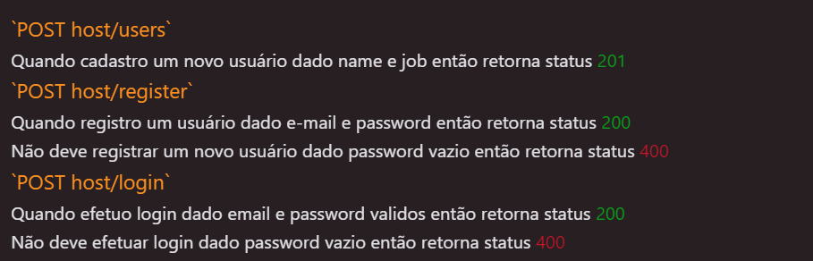
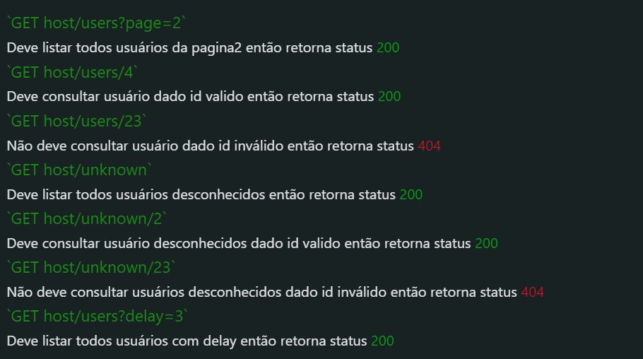

# Testes Automatizados de API

## Desafio - Getnet

API utilizada: https://reqres.in/api

Este projeto possui testes automatizados de API, para o desafio da Getnet.
Nele foram feitos testes automatizados em dois Frameworks separados: Rest-Assured e Robot Framework com auxílio da plataforma Postman, baseando-se na documentação da API https://reqres.in/api-docs/

#

## ⚙️ Frameworks Utilizados

## 🌐 RestAssured

Tecnologias utilizadas:

- [REST Assured](https://rest-assured.io)
- [JUnit](https://junit.org/junit4)
- [Maven](https://maven.apache.org)
- [Postman](https://www.postman.com)

Estrutura das pastas:

📂 services/</br>
&nbsp; &nbsp; &nbsp;🍵Base.java (Onde está classe base)<br>
📂 services/</br>
&nbsp; &nbsp; &nbsp;🍵Service.java (Onde está classe de services)<br>
📂 suitesTets/<br>
&nbsp; &nbsp; &nbsp;🍵TestDelete.java (Onde está classe para excluir cadastro)<br>
&nbsp; &nbsp; &nbsp;🍵TestGetUser.java (Onde está classe de consultas)<br>
&nbsp; &nbsp; &nbsp;🍵TestPatchUser.java (Onde está classe de atualizar cadastros)<br>
&nbsp; &nbsp; &nbsp;🍵TestPostUser.java (Onde está classe de cadastros)<br>
&nbsp; &nbsp; &nbsp;🍵TestPutUser.java (Onde está classe de atualizar cadastros)<br>
🪶pom.xml (Arquivo do maven com as configurações e repositórios)

## 🚀 Rodando o Projeto RestAssured

```bash
# Clone este repositório
$ git clone https://github.com/diogomfc/challenge_getnet_api
# ou use a opção de download.

# Acesse a pasta do projeto
$ cd challenge_getnet_api

# Acesse a pasta do em restassured
$ cd getnet_api_restassured

# Instale as dependências e plugin no repositório maven conforme arquivo pom.xml
https://mvnrepository.com/

# Executando os testes
Para executar os testes vá até a pasta de testes desejada e execute.

```

---

## 🤖 Robot Framework

Tecnologias utilizadas:

- [Robot Framework](https://robotframework.org/)

Estrutura das pastas:

📂 services/</br>
&nbsp; &nbsp; &nbsp;🍵Base.java (Onde está classe base)<br>
📂 services/</br>
&nbsp; &nbsp; &nbsp;🍵Service.java (Onde está classe de services)<br>

## 🚀 Rodando o Projeto Robot Framework

```bash
# Clone este repositório
$ git clone https://github.com/diogomfc/challenge_getnet_api
# ou use a opção de download.

# Acesse a pasta do projeto
$ cd challenge_getnet_api

# Acesse a pasta do em restassured
$ cd getnet_api_restassured

# Instale as dependências e plugin no repositório maven conforme arquivo pom.xml
https://mvnrepository.com/

# Executando os testes
Para executar os testes vá até a pasta de testes desejada e execute.

```

---

### 🟠 Postman


Adicionado na 📂 postman do projeto collection e environment.

---

## 🧪 Cobertura dos testes


<p style='font-size: 17px'>Este endpoint é responsável por cadastrar um novo usuário</p>.</p>



<p style='font-size: 17px'>Este endpoint é responsável por retorna a simulação previamente cadastrada</p>



<p style='font-size: 17px'>Este endpoint é responsável por alterar um cadastro já existente.</p>


<p style='font-size: 17px'>Este endpoint é responsável por remover um usuário previamente cadastrado pelo seu ID.</p>


[⬆ Voltar ao topo](#)<br>

---

<div align="center">
  <a href="https://www.linkedin.com/in/diogo-pgs-silva/" alt="Instagram" target="_blank">
  
</a>
</div>
<div align="center">
<small>Diogo Silva - 2022</small>
</div>
