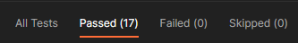
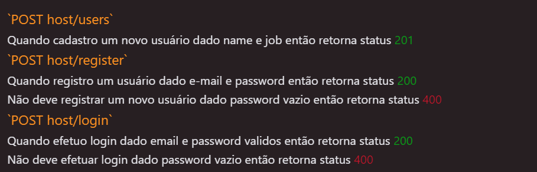
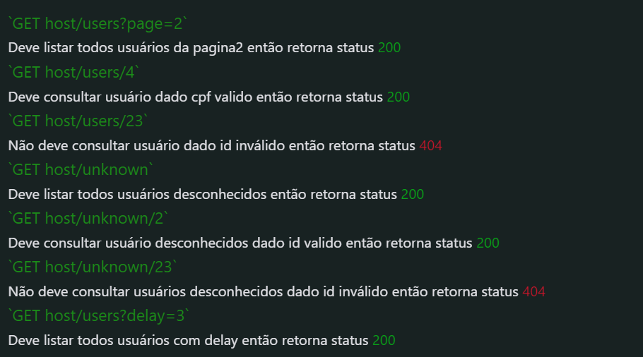
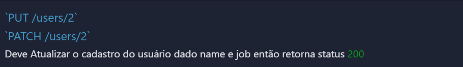
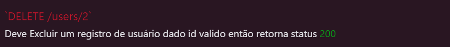

# Testes Automatizados de API

## Desafio - Getnet

API utilizada: https://reqres.in/api

Este projeto possui testes automatizados de API, para o desafio da Getnet.
Nele foram feitos testes automatizados no **Robot Frameworks** com auxílio da plataforma **Postman**, baseando-se na documentação da API https://reqres.in/api-docs/

#

## 🤖 Robot Framework

- Escrita de cenários de teste em BDD
- Utilização das libraries do Robot
- Lidar com requests e responsess
- Manipular dados estáticos

## Pré-requisitos

- <a href="https://www.python.org/downloads/">Python 3</a>: é a linguagem base do Robot Framework
- <a href="https://robotframework.org/">Robot Framework</a>: para fazer a automação de testes através das libraries
- <a href="https://git-scm.com/downloads">Git</a>: para clonar o projeto para a sua máquina
- <a href="https://code.visualstudio.com/">Visual Studio Code</a> para rodar o projeto na sua máquina

## Libraries utilizadas

- <a href="https://robotframework.org/robotframework/latest/libraries/BuiltIn.html#library-documentation-top">BuiltIn</a>: library padrão do Robot que possui as palavras-chave mais utilizadas
- <a href="https://marketsquare.github.io/robotframework-requests/doc/RequestsLibrary.html#library-documentation-top">RequestsLibrary</a>: utilizada para fazer as requisições HTTP REST
- <a href="https://pypi.org/project/robotframework-faker/">Robot Framework Faker</a>: para fazer um fake das massas de dados dentro dos testes
- <a href="https://robotframework.org/robotframework/latest/libraries/OperatingSystem.html">Operating System</a>: para ler os arquivos JSON

## Extensões VS Code recomendadas

- <a href="https://marketplace.visualstudio.com/items?itemName=ms-python.python">Python</a>
- <a href="https://marketplace.visualstudio.com/items?itemName=d-biehl.robotcode">Robot Code</a>
- <a href="https://marketplace.visualstudio.com/items?itemName=TabNine.tabnine-vscode">Tabnine AI Autocomplete</a>

## Estrutura das pastas

📂 resources</br>
&nbsp; &nbsp; &nbsp;📂 inputData (Onde está aquivos de data)<br>
&nbsp; &nbsp; &nbsp;📂 steps (Onde está os guias para cada end point)<br>
&nbsp; &nbsp; &nbsp; &nbsp;&nbsp;&nbsp;&nbsp;🤖 stepPOST.robot <br>
&nbsp; &nbsp; &nbsp; &nbsp;&nbsp;&nbsp;&nbsp;🤖 stepGET.robot <br>
&nbsp; &nbsp; &nbsp; &nbsp;&nbsp;&nbsp;&nbsp;🤖 stepPATCH.robot <br>
&nbsp; &nbsp; &nbsp; &nbsp;&nbsp;&nbsp;&nbsp;🤖 stepPUT.robot <br>
&nbsp; &nbsp; &nbsp; &nbsp;&nbsp;&nbsp;&nbsp;🤖 stepDELETE.robot <br>
&nbsp; &nbsp; &nbsp;🤖 base.robot (Onde está o arquivo base para os steps)<br>
📂 results (Onde está os reports)<br>
📂 suitesTests (Onde está os testes para cada end point)<br>
&nbsp; &nbsp; &nbsp;🤖 TestPostUser.robot<br>
&nbsp; &nbsp; &nbsp;🤖 TestGetUser.robot<br>
&nbsp; &nbsp; &nbsp;🤖 TestPatchUser.robot <br>
&nbsp; &nbsp; &nbsp;🤖 TestPutUser.robot <br>
&nbsp; &nbsp; &nbsp;🤖 TestDelete.robot <br>
📂 variables (Onde está as variables do projeto) <br>
&nbsp; &nbsp; &nbsp;🤖 variables.robot<br>

## 🚀 Rodando o Projeto Robot Framework

```bash
# Instale o Robot Framework na sua máquina através do CMD
pip install robotframework

# Verifique se a instalação foi bem sucedida
robot --version

#Instale a RequestsLibrary
pip install robotframework-requests
pip install robotframework-faker
pip install -U robotframework-jsonlibrary

# Clone este repositório
$ git clone https://github.com/diogomfc/challenge_getnet_api
# ou use a opção de download.

# Acesse a pasta do projeto
$ cd challenge_getnet_api

# Acesse a pasta do em Robot Framework
$ cd getnet_api_robot

# Executando os testes
Para executar os testes vá até a pasta Suites Tests e execute o teste desejado.

ou

$ robot -d ./results -i GET suitesTests
$ robot -d ./results -i PUT suitesTests
$ robot -d ./results -i PATCH suitesTests
$ robot -d ./results -i POST suitesTests
$ robot -d ./results -i DELETE suitesTests

```

---

### 🟠 Postman



Adicionado na 📂 postman do projeto collection e environment.

---

## 🧪 Cobertura dos testes


<p style='font-size: 17px'>Este endpoint é responsável por cadastrar um novo usuário.</p>



<p style='font-size: 17px'>Este endpoint é responsável por retorna os usuários previamente cadastrados.</p>



<p style='font-size: 17px'>Este endpoint é responsável por alterar um cadastro já existente.</p>



<p style='font-size: 17px'>Este endpoint é responsável por remover um usuário previamente cadastrado pelo seu ID.</p>


[⬆ Voltar ao topo](#)<br>

---

<div align="center">
  <a href="https://www.linkedin.com/in/diogo-pgs-silva/" alt="Instagram" target="_blank">
  
</a>
</div>
<div align="center">
<small>Diogo Silva - 2022</small>
</div>
